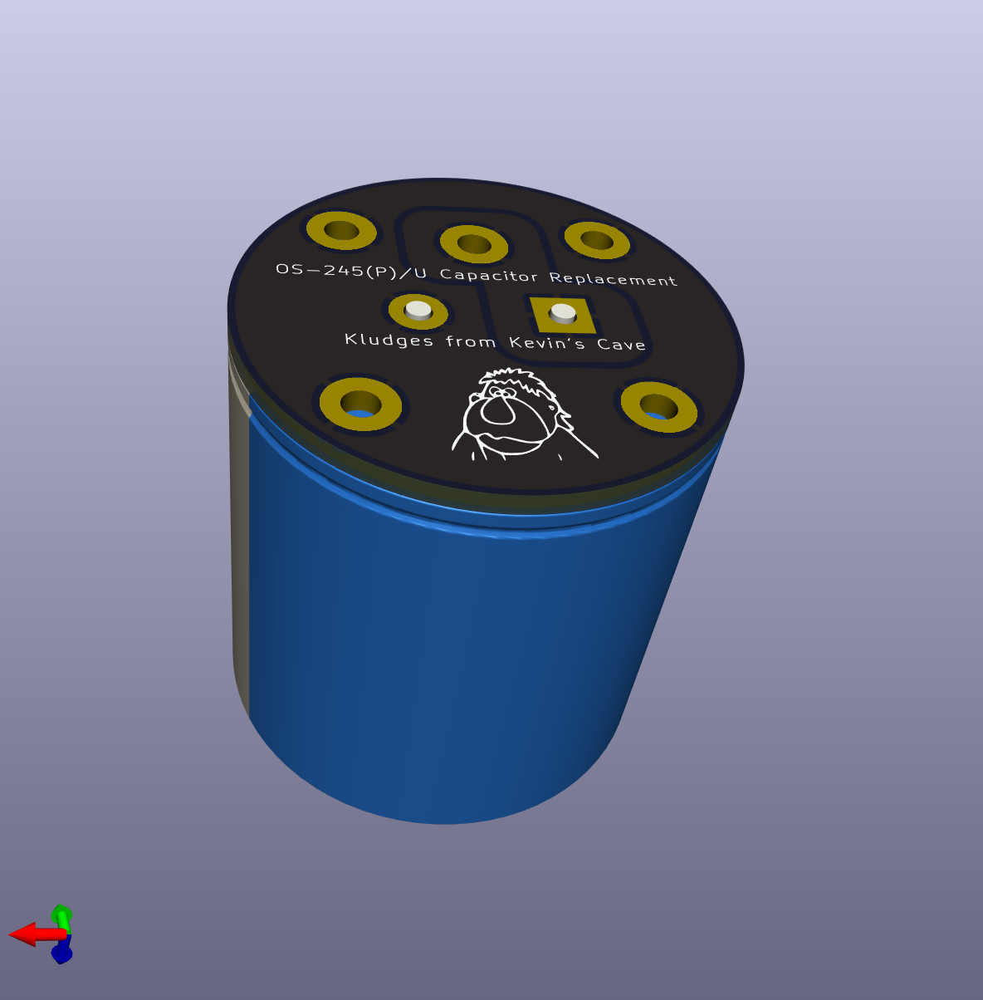

# Restoring a 50-Year-Old Analog Oscillope
## Episode 3: Replacing a Capacitor

This folder contains the files that were used to design the adapter to mount
a modern capacitor in place of a failed one.

Video link: [https://youtu.be/u-VB3HTjkvM]

| File | Description |
| gerbers/ | Gerber files and Excellon drill files for the adapter board |
| tek-cap-pcb.kicad_pro | KiCAD project file for the adapter board |
| tek-cap-pcb.kicad_prl | KiCAD extended settings for the adapter board |
| tek-cap-pcb.kicad_sch | KiCAD schematic for the adapter board |
| tek-cap-pcb.kicad_pcb | KiCAD PCB layout for the adapter board |
| tek-cap-pcb.png | KiCAD rendering of the adapter board |

