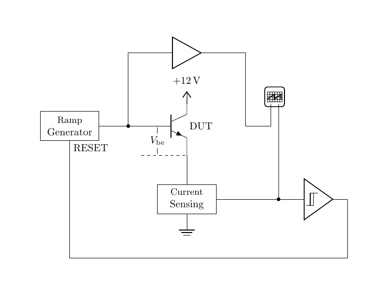

# Transistors 101, Side Project: Current-vs-voltage curve tracer.

This miniseries designs, builds and debugs a simple instrument
to measure the forward current-versus-voltage curve of a transistor
or diode.

## Part 1: Designing the tracer

Video link: [Part 1](https://youtu.be/jY0oFNUrtkE)

The idea behind the project is to put a voltage ramp into a transistor
or diode, and measure the voltage going in and the current coming out.

The episode comes up with a detailed design, to be built in the
episode that follows.

| File name | Description |
| --------- | ----------- |
| `schmitt-values.py | Python script to derive the resistor values for the reset circuit |
| `tracer2/`  | KiCAD project containing the schematics as designed in this part |
| `tracer2.pdf` | Printable schematic of the circuit, with annotations |

## Part 2: Building and testing the tracer

Video link: [Part 2](https://example.org/this-space-for-rent/)

In the second episode, we build the tracer hardware and test out
the tracer's operation.

We need to fix a few bugs, so there are some modifications made
to the schematic along the way.

| File name | Description |
| --------- | ----------- |
| `breadboard.odp` | LibreOffice Impress annotated photo of breadboard circuit |
| `breadboard.png` | Annotated photo of breadboard circuit |
| `tracer3/` | KiCAD project containing the schematic as modified |
| `tracer3.pdf` | Printable schematic of the circuit as modified |

# Part 3: Software to run the tracer

Video link: [Part 3](https://example.org/this-space-for-rent/)

In the third episode, we develop Python software to automate testing
with the tracer. The target platform is the Rigol DS1054Z oscilloscope.

There are a couple of modifications to the schematic, not discussed
in the video, to suppress some transients that were not observed in the
last episode but caused trouble as more devices were measured.

The software in this repository is slightly newer than what is shown
in the video, but the fundamental structure is sttll the same.

| File name | Description |
| --------- | ----------- |
| `run_tracer.py` | Python script that runs the oscilloscope with the tracer |
| `tracer4/` | KiCAD project containing the schematic actually used
| `tracer4.pdf` | Schematic of the tracer actually used for device testing
